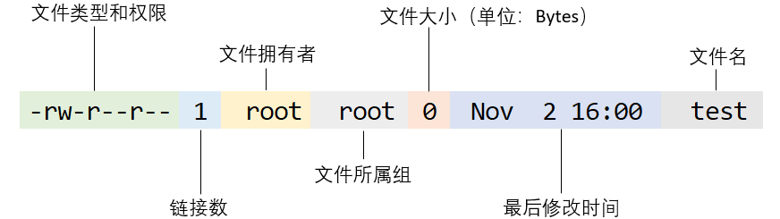
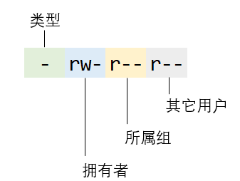

### ch05 - Linux 的文件权限与目录配置

#### 1. 文件权限

在 Linux 系统中，任何一个文件都具有 3 组权限标识符，用于限定文件拥有者、文件所属组以及其他用户对该文件可执行的操作。权限可划分为读权限、写权限和执行权限，使用字母 r、w、x 进行表示。

通过 touch 命令创建一个普通文件，然后执行 ls 命令查看文件的属性：

```shell
$ touch test
$ ls -l test
-rw-r--r-- 1 root root 0 Nov  2 16:00 test
```

命令的输出共有 7 列，每列表示的含义如下所示：



第 1 列由 10 个字符组成，其中，第 1 个字符表示文件的类型，常见的有 3 种：

```
-：常规文件
d：目录
l：链接文件
```

后面的 9 个字符被划分为 3 组，分别表示文件拥有者的权限、文件所属组的权限和其它用户的权限。本例中，第 1 列的输出可以被描述为”该文件是一个常规文件，其拥有者具有读写权限，所属组和其它用户仅有读权限“，即：




需要注意的一点是，对于普通文件和目录文件而言，读权限、写权限和执行权限表现的行为有所差异，具体如下：

|          | 普通文件                         | 目录文件                           |
| -------- | -------------------------------- | ---------------------------------- |
| 读权限   | 可读取文件的实际内容             | 可读取目录结构                     |
| 写权限   | 可修改文件的内容，但无法删除文件 | 可修改目录结构，包括删除内部的文件 |
| 执行权限 | 可被操作系统执行                 | 可进入目录                         |

#### 2. 修改权限

合理的设置文件权限可以有效的保护系统的数据，常用的权限修改命令有 3 个，分别是：

- chgrp：修改文件的所属组；
- chown：修改文件的拥有者；
- chmod：修改文件的权限。

举例说明，若打算将 test 文件的拥有者以及所属组分别修改为  test_user 和 test_group，权限设置为拥有者具有 rwx 权限、所属组和其它用户具有 r-x 权限，则可以通过下面的命令实现：

```shell
$ chown test_user test		注：需要保证系统内存在 test_user 用户
$ chgrp test_group test		注：需要保证系统内存在 test_group 用户组
$ chmod u=rwx,go=r-x test	注：也可以使用 chmod 755 test 实现相同的需求
$ ls -l test
-rwxr-xr-x 1 test_user test_group 0 Nov  2 17:00 test
```

#### 3. Filesystem Hierarchy Standard

FHS 是 Filesystem Hierarchy Standard 的缩写，用于规范 Linux 系统中的目录结构以及目录内容，不同的发行版存在一定的差异，但差异性有限。